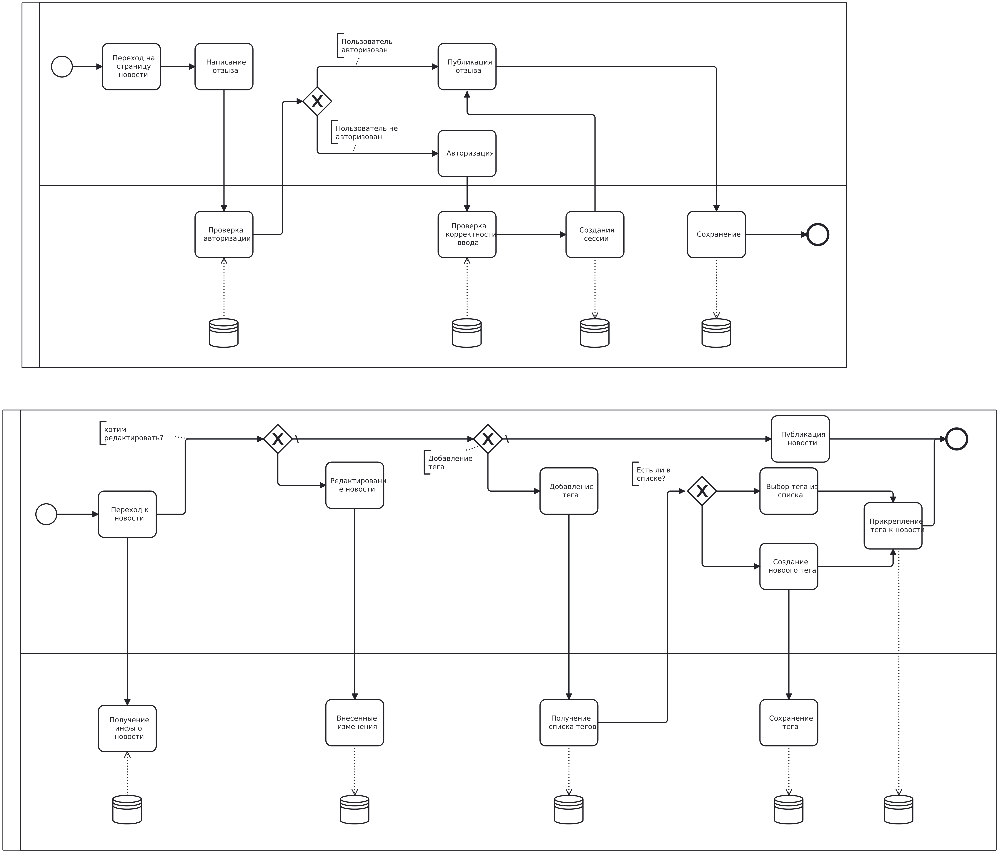

# Задание: Реализация бизнес-процесса "РИА Новости" с использованием Spring Boot и BPMN 2.0

## Описание задания

Вариант №1009: "РИА Новости" - http://www.ria.ru

## Порядок выполнения работы

1. **Выбор бизнес-процесса**: Выбрать один из бизнес-процессов, реализуемых сайтом из варианта задания.
2. **Утверждение бизнес-процесса**: Утвердить выбранный бизнес-процесс у преподавателя.
3. **Спецификация модели бизнес-процесса**: Специфицировать модель реализуемого бизнес-процесса в соответствии с требованиями BPMN 2.0.
4. **Разработка приложения на Spring Boot**: Разработать приложение на базе Spring Boot, реализующее описанный на предыдущем шаге бизнес-процесс. Приложение должно использовать СУБД PostgreSQL для хранения данных, для всех публичных интерфейсов должны быть разработаны REST API.
5. **Тестирование с помощью Insomnia**: Разработать набор запросов для REST клиента Insomnia для тестирования публичных интерфейсов разработанного программного модуля. Запросы Insomnia оформить в виде файла экспорта.
6. **Развертывание на сервере helios**: Развернуть разработанное приложение на сервере helios.

## Реализация задания

### Модель потока управления для автоматизируемого бизнес-процесса

### UML-диаграмма

## Вывод

В ходе выполнения этого задания мы разработали и реализовали бизнес-процесс публикации новостей с тегами и написании отзывов на сайте "РИА Новости" с использованием Spring Boot и BPMN 2.0.